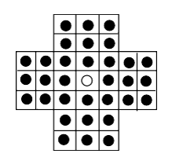
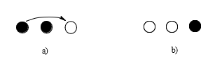
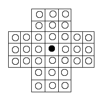

# RestaUm

## Participantes
* Thomaz de Souza Scopel - RA: 10417183
* Vinícius Sanches Cappatti - RA: 10418266

## Objetivo
objetivo deste trabalho é implementar uma técnica de backtrack para resolver o problema de um jogo de tabuleiro conhecido como Resta um. No início do jogo, temos 33 buracos e 32 pinos dispostos em forma de cruz, com a posição central vazia.

Ao executar um movimento válido na horizontal ou na vertical, os pinos serão gradual- mente removidos do tabuleiro. Um movimento válido é descrito da seguinte maneira. Sejam três posições (A, B, C) consecutivas no tabuleiro (na horizontal ou na vertical), com A e B pre- enchidas e C vazia. O movimento válido consiste em eliminar a peça que está na posição B e mover a peça que está em A para a posição vazia C.

O objetivo do jogo é, após 31 movimentos válidos, obter apenas o pino central na posição central do tabuleiro (aquela que estava vazia no início). Seu programa deve, no final, imprimir uma sequência de movimentos que leva à configuração final desejada e também salvar em arquivo.

## Link para explicação
